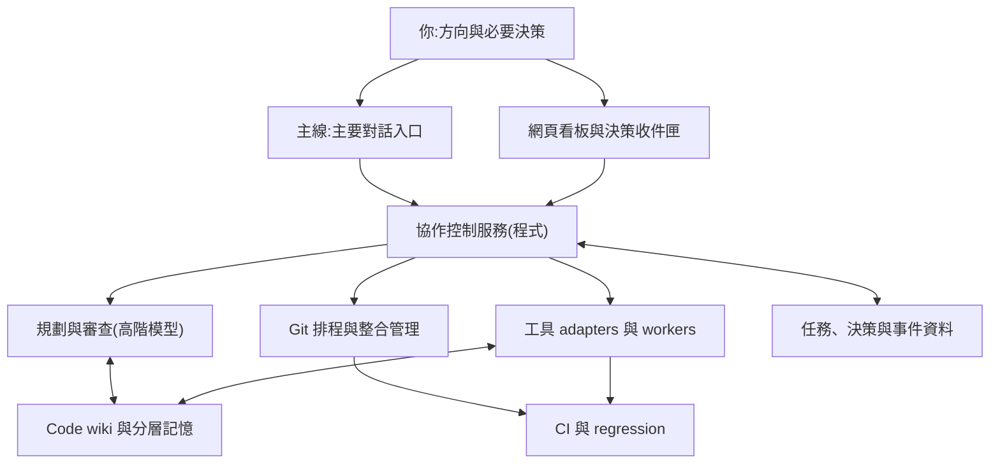

# Agent Control:一人主導的多模型軟體研發協作系統

版本:v1.1 依使用者補貼原文校正 日期:2026-09-10。**這是產品負責人的原始提案,逐字保留;主線的審稿在文末。**

## 1. 提案結論與資料邊界
這個方向合理,也具有明確的使用價值:讓一個人透過主要 AI 窗口,管理能規劃、分工、實作、審查、驗證、整合與累積經驗的軟體研發團隊。系統應降低人的協調負擔,讓更多需求可靠地轉化成可交付成果。

你目前已運作 Fable 主要入口、複雜情境下的 Fable/Astra 規劃、Fable 選 worker、高階模型 review、開票時訂定測試方向及執行票相關測試,也已建立顯示所有票、狀態與本人待決事項的網頁看板。你希望進一步補齊 Git/regression 排程、AI code wiki、跨 session 的模型記憶與整理、訂閱感知選模,以及產品與執行層級的圖形化觀測。

## 2. 核心思想
你提出產品方向與需求,Fable 持續理解意圖並統籌工作;需要深度判斷時,Fable 和 Astra 討論或分別規劃後整合;工作以具備決策、範圍、依賴及驗收條件的票交給合適的 worker;高階模型負責 review;專責管理者安排平行工作與程式整合;所有 agent 能快速取得可信的 code 知識,並保留各自經驗。你希望隨時從網頁看板知道:產品走到哪裡、哪些功能尚未完成、多少 AI 正在工作、時間花在哪裡、誰被什麼卡住、token 用在什麼用途,以及哪些問題需要自己判斷。

**系統成功的核心指標,是你花更少協調時間,就能得到更多通過驗收的成果。**

## 4. 合理性與完整度評估(摘)
整體評語:願景與需求已能形成完整產品提案;工程上最需要補的是可驗證的協作契約。**不能只靠 agent 在對話中「記得規則」。**

## 5. 整體系統架構

「協作控制服務」負責保存狀態、確認條件、發出工作與記錄結果。AI 負責需要判斷的部分;依賴檢查、租約、重試計數、合併條件和成本上限由程式執行。網頁上的核准、優先序調整與取消也送進同一控制服務,並回映給主線;你不需要再口頭同步一次。

## 6. 角色(見 docs/ROLES.md)
產品負責人 / 協調者 / 規劃者 / Git 整合管理者 / Worker / 高階 Reviewer / 驗證執行器 / 知識維護者。角色是責任分類,不等於七個常駐模型;作者與審查者應使用分離的執行上下文。

## 7. 從需求到交付
接收需求 → 查詢現有事實 → 規劃(複雜者雙方案比較)→ 形成決策(只把會改變方向、範圍或重要成本的問題提交給人)→ 拆成可派工票 → 計算排程(程式檢查依賴、寫入範圍、資源、配額,發出租約)→ 組裝任務上下文 → 執行 → 局部驗證與 review → 候選整合與 regression(結果必須屬於該候選版本)→ 合併與交付判斷(驗證目標分支未變動、證據仍有效)→ 知識回寫。需求中途改變時產生新的需求版本並辨識受影響票。

## 8. 狀態與完成定義
`Draft → Ready → Running → InReview → IntegrationQueued → Integrating → Done`;`Blocked / NeedsDecision / Failed / Cancelled` 保存原因與回復點。`未執行`、`失敗`、`環境錯誤`、`依政策不適用` 分開記。**Worker 宣告完成或 exit code 為零,均不足以推動 Done。**

## 9. 每張票的最小契約(見 tickets/SCHEMA.md)
產品關聯 / 目標與範圍 / 高階規劃內容 / 依賴與衝突(allowed_write_paths)/ 執行身份(attempt_id)/ 版本與環境(base_sha)/ 控制(state_version、lease、retry_limit、budget)/ 交付(evidence refs)。

## 10. 平行工作規則
排程至少檢查:功能依賴、寫入範圍衝突、介面/語意耦合、共用執行資源。**不同檔案不代表可以安全平行。** 第一版保守:同一 repo 邏輯路徑的寫入範圍不可重疊;每票自己的 worktree/branch。路徑租約不能只是一句 prompt;跨界寫入先攔截或凍結交付。排程加入等待時間權重,避免困難票永遠被小票插隊。

## 11. Commit、整合與 regression
**測試證據必須指向實際驗證的程式狀態。** 每次 TestRun 記錄候選 SHA、基準版本、套件版本、指令、工具鏈、時間、結果。測試分層:快速檢查 / 影響範圍 / 整合 regression / 完整驗證。第一版 merge queue 每次一個候選:H+A 通過後確認主線仍是 H 再原子更新。不能把較舊版本的通過結果當成新版本已通過。

## 12. Code Wiki(見 docs/CODE-MAP.md)
專案入口 / 模組卡片 / 決策紀錄 / 驗證與故障知識;每張卡帶 source_paths、verified_at_commit、有效狀態;合併後標記受影響卡片 stale。先用短 Markdown 與符號搜尋驗證價值;維護若比節省的工作貴,就縮小範圍。

## 13. 記憶分層(見 docs/MEMORY.md)
每種模型有自己的記憶;記錄與其他模型討論時發現的自身盲點;同模型 sessions 共享;超過可調門檻時由高階模型整理。專案共識 / 模型經驗 / 任務交接 / 原生工具狀態四層。經驗晉升成共用知識要有來源、去重、驗證。壓縮不能把未達共識的討論寫成事實。

## 14. 選模、訂閱與預算
先權限與能力,再帳號可用性與配額,再實測品質、返工、等待、成本。總成本包含規劃、實作、review、重試、regression、知識維護與人的介入時間。配額耗盡按政策等待、切換或送入收件匣,**不能默默改成付費通道**。

## 15. 看板與收件匣
產品總覽 / 票務與依賴 / 執行時間線 / Git 與 regression / 資源與用量 / 決策收件匣。每個待決事項含問題、背景、方案、建議、受影響任務、期限、既有授權。用量區分 provider 回報、估計、無法取得;**未知不可顯示為零**。

## 16. 中斷、失敗與恢復
Worker 中斷 → checkpoint 與租約到期後查驗再恢復;舊 worker 延遲回報用 attempt_id / state_version 拒絕;API 失敗有上限重試;反覆失敗升級或重規劃;CI 環境故障記 infra error 不記通過;flaky 不能重跑到綠;依賴改變失效相關候選;取消要收斂子程序與鎖;每個外部操作有穩定 operation_id,遺失回覆先查實際狀態。

## 17–19. 接入、第一版邊界、分階段
先對實際安裝的工具建能力表(啟動、狀態、停止、上下文、模型、用量、隔離)。第一版:單一控制服務、持久資料、背景執行器、網頁;單 repo、少量 worker、保守排程、簡單 merge queue。階段 0 盤點 → 1 單票閉環 → 2 受控平行 → 3 知識與選模 → 4 產品管理。

## 20. 必須通過的代表性情境
兩張無衝突票平行、依賴票不誤啟動;越界寫入被攔;主線改變後舊結果失效;重啟後恢復且無重複合併;交接包足以接手;原生記憶與決策衝突被記錄;取消後遲到回報不能改 Done;無 token 資料顯示未知;reviewer 退回可定位;看板決策後主線看到同一結果。

## 21. 如何判斷值得繼續
每張已驗收票的人工作業分鐘、需求到驗收的中位數與尾端、一次通過比例、合併後缺陷與 revert、每個成果的總資源成本、中斷恢復成功率、wiki 查找收益、等待決策時間。第一個里程碑:**你提出一個需求,系統能完成規劃、執行、獨立 review、版本一致的整合驗證與知識回寫;你能在看板理解進度,且過程中斷後不用從頭交代。**

---

## 主線審稿(Fable,2026-09-12)
1. **中心論點已被 tabby_pool 三天的事故證明**:每個出事的地方都是一條只活在提示裡的規則。→ D-001。
2. **硬限制**:Claude Code 的子 agent 無法從外部啟動、觀測、中止;控制服務不能站在它外面,協調者必須自己是 Claude Code session 或走 SDK。Codex、agy 有非互動模式。
3. **協調者自己會撞額度**:一天內 Fable、Codex、Opus 都撞過;§14 只講 worker,要補「協調者掛了誰接手」→ `scripts/heartbeat.sh`。
4. **它是一個平台規格**;第一版只做 §18 的最小集合,而且一半已經存在(land.sh = merge queue、DECISIONS = 共識層、DISPATCH-TEMPLATE = 上下文包)。差的是把「文字」變成「欄位與程式」。
5. **wiki 先不建**,等查找失敗累積到看得出形狀。→ D-004。
6. 落地順序:票欄位 → 拆排程與落地 → 收件匣事件 → 模型私有記憶 → 其餘。
